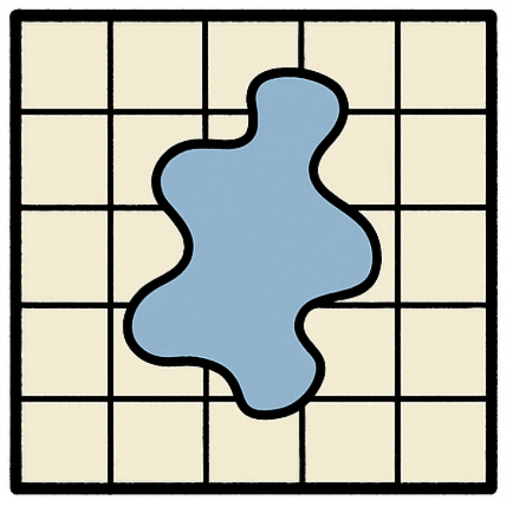

# f1_trainer

    

A repo for the MVP NRT CNN Capability. This work builds on the prototype model trained on MODIS flood satellite images

Getting Started

This repo is managed through UV and can be installed through:
uv venv .venv --python 3.12.0
source .venv/bin/activate
uv sync                 # installs everything from pyproject.toml
uv pip install -e .      # editable install of your own package

Development

To ensure that F1-trainer code changes follow the specified structure, be sure to install the local dev dependencies and run pre-commit install

Documentation

To build the user guide documentation for F1-trainer locally, run the following commands:

uv pip install ".[docs]"
mkdocs serve -a localhost:8080
Docs will be spun up at localhost:8080/
